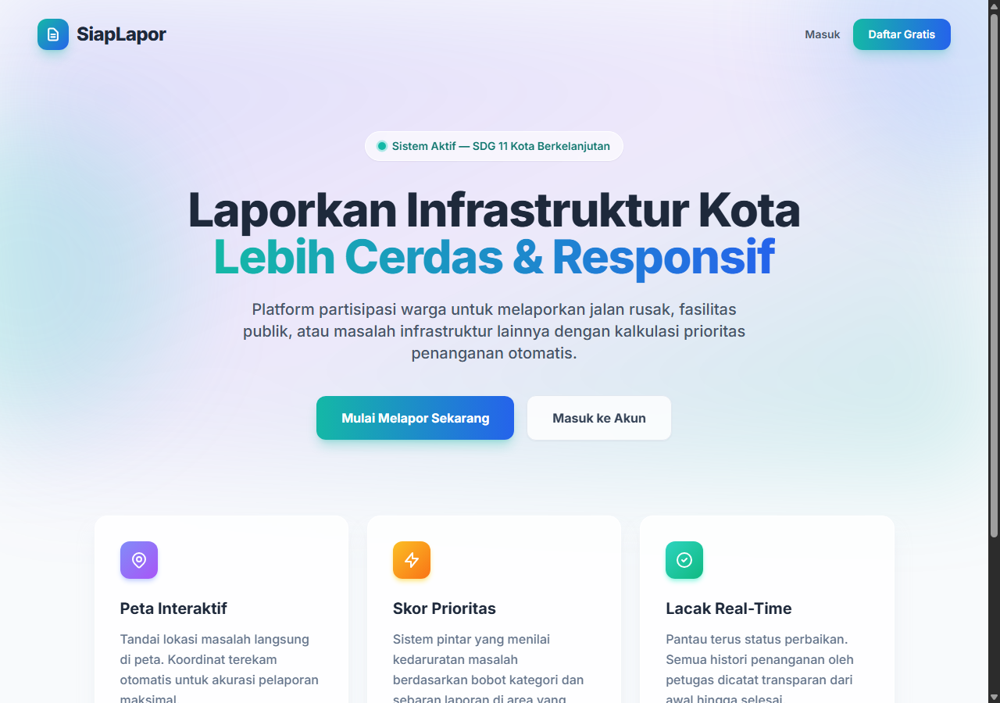
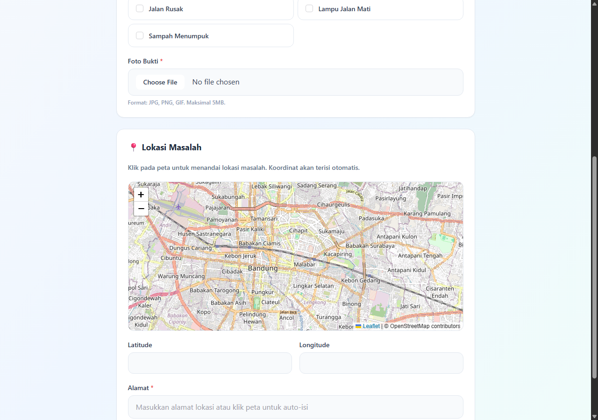
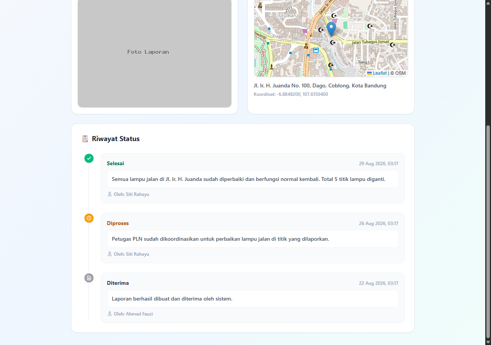
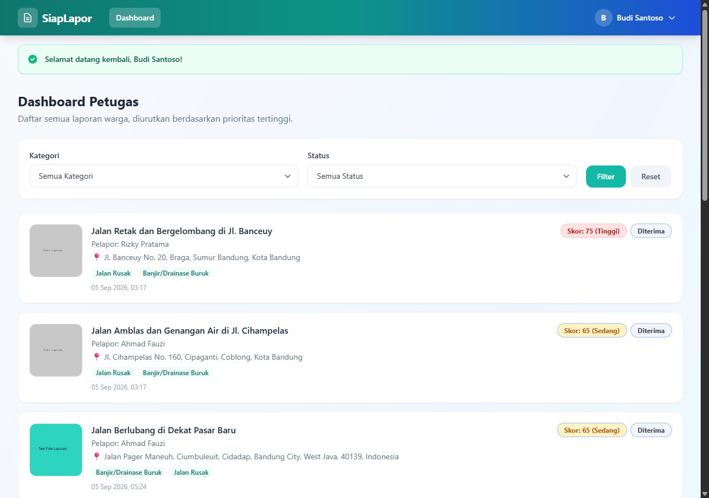
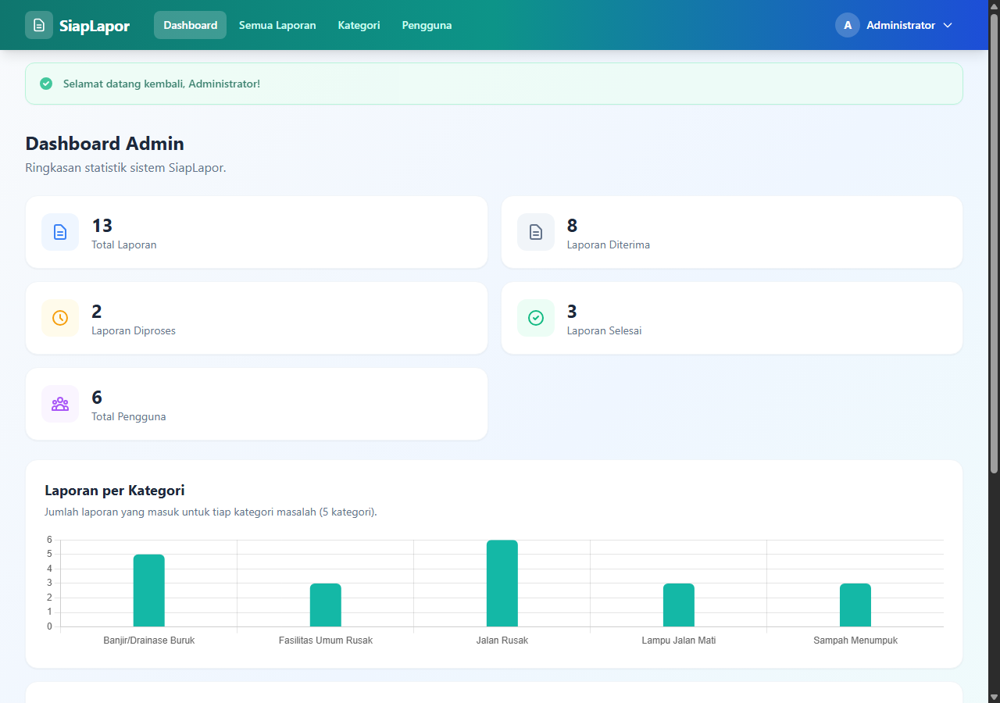

# 🚨 SiapLapor

<p align="center">
  <b>Platform Pelaporan dan Pemantauan Infrastruktur Kota Berbasis Prioritas</b>
</p>

<p align="center">
  
  
  
  
  
  
</p>

---

> 🎓 **Study Case Seleksi Asisten Lab & Asisten Praktikum**  
> **EISD Lab** (*Enterprise Intelligent and Systems Development*) — Program Studi S1 Sistem Informasi, Telkom University.

**SiapLapor** adalah aplikasi berbasis web yang memungkinkan warga melaporkan masalah infrastruktur kota (seperti jalan rusak, sampah menumpuk, penerangan jalan mati) lengkap dengan titik koordinat di peta interaktif dan foto bukti. Sistem secara otomatis menghitung **skor prioritas laporan** berdasarkan kombinasi bobot kategori dan penumpukan laporan serupa dalam radius tertentu, sehingga petugas dapat menindaklanjuti laporan secara objektif berdasarkan urgensi.



---

## 📑 Daftar Isi

- [📌 Latar Belakang](#-latar-belakang)
- [🚀 Fitur Utama](#-fitur-utama)
- [🛠️ Tech Stack](#️-tech-stack)
- [🗄️ Struktur Database](#️-struktur-database)
- [⚡ Cara Menjalankan Project dari Nol](#-cara-menjalankan-project-dari-nol)
- [🔑 Akun Demo untuk Testing](#-akun-demo-untuk-testing)
- [⭐ Fitur Unggulan](#-fitur-unggulan)
- [🧪 Menjalankan Test](#-menjalankan-test)
- [📁 Struktur Folder Singkat](#-struktur-folder-singkat)

---

## 📌 Latar Belakang

Isu infrastruktur kota berkaitan erat dengan **SDG 11: Sustainable Cities and Communities**. Warga sering kali menemukan masalah infrastruktur di sekitarnya, namun terkendala tidak adanya kanal pelaporan terstruktur yang transparan dan dapat membantu menentukan prioritas penanganan.

**SiapLapor** hadir menjawab tantangan ini dengan alur kerja yang terstruktur:
1. **Warga Melapor** — Mengisi formulir interaktif lengkap dengan penentuan lokasi di peta & upload foto.
2. **Kalkulasi Prioritas** — Sistem otomatis mengkalkulasi skor urgensi laporan.
3. **Penanganan Terarah** — Petugas memproses laporan berdasarkan urutan skor prioritas tertinggi (*bukan siapa cepat dia dapat*).
4. **Pemantauan Transparan** — Warga dapat memantau progres status penanganan secara *real-time* melalui timeline riwayat status.

---

## 🚀 Fitur Utama

### 👤 Role: Warga
- **Autentikasi**: Registrasi akun baru & login.
- **Buat Laporan Interaktif**: Formulir judul, deskripsi, penentuan titik lokasi pada peta (koordinat otomatis terisi), reverse geocoding alamat, pemilihan multi-kategori, dan upload foto bukti.
- **Riwayat Laporan**: Menampilkan seluruh daftar laporan milik warga beserta status terkini.
- **Detail & Timeline**: Melihat detail laporan lengkap dengan grafik timeline riwayat perubahan status oleh petugas.
- **Manajemen Profil**: Edit nama, nomor telepon, alamat, dan ubah password.

### 👮 Role: Petugas
- **Autentikasi**: Login khusus akun Petugas.
- **Priority Dashboard**: Halaman khusus yang menampilkan seluruh laporan warga yang otomatis diurutkan dari skor prioritas tertinggi ke terendah.
- **Filtering & Search**: Filter laporan berdasarkan kategori masalah dan/atau status penanganan.
- **Update Status Transparan**: Memperbarui status laporan (`Diterima` → `Diproses` → `Selesai`) disertai catatan penanganan yang tersimpan secara *append-only* sebagai riwayat audit.

### 👑 Role: Admin
- **Autentikasi**: Login khusus akun Admin.
- **Dashboard Analitis**: Ringkasan statistik total laporan, jumlah per status, serta visualisasi grafik statistik laporan per kategori (Chart.js).
- **Manajemen Kategori (CRUD)**: Kelola data kategori infrastruktur beserta penentuan `priority_weight` (bobot prioritas).
- **Manajemen Pengguna (CRUD)**: Kelola penuh akun Warga dan Petugas.
- **Pengawasan Global**: Melihat seluruh data laporan yang masuk di dalam sistem secara komprehensif.

> [!IMPORTANT]
> **Kontrol Akses Middleware**: Seluruh route dan fitur dilindungi oleh `RoleMiddleware` kustom untuk memastikan tiap peran hanya dapat mengakses hak akses yang diizinkan.

---

## 🛠️ Tech Stack

| Kategori | Teknologi | Deskripsi |
|---|---|---|
| **Backend Framework** | Laravel 12 (PHP ^8.2) | Core MVC framework |
| **Authentication** | Laravel Breeze | Starter kit autentikasi |
| **Frontend** | Blade Templates, Tailwind CSS 3, Alpine.js | UI/UX responsif & interaktif |
| **Build Tool** | Vite | Asset bundler & HMR |
| **Database** | SQLite | Serverless database (siap pakai) |
| **Interactive Map** | Leaflet.js + OpenStreetMap | Maps interaktif tanpa API key |
| **Reverse Geocoding** | Nominatim API | Konversi koordinat GPS ke nama alamat |
| **Charts** | Chart.js | Visualisasi statistik dashboard Admin |

> [!NOTE]
> **Arsitektur Murni Laravel MVC**: Seluruh Controller, View, dan Routing dibangun secara manual tanpa menggunakan admin panel builder instan (seperti Filament, Nova, atau Backpack).

---

## 🗄️ Struktur Database

### Tabel Utama

| Tabel | Keterangan |
|---|---|
| `users` | Mengelola data pengguna dengan kolom `role` (`warga`, `petugas`, `admin`) |
| `categories` | Master data kategori masalah beserta kolom `priority_weight` |
| `reports` | Data laporan warga (judul, deskripsi, foto, alamat, koordinat, `status`, `priority_score`) |
| `report_category` | Tabel pivot relasi *many-to-many* antara `reports` dan `categories` |
| `status_histories` | Catatan riwayat setiap perubahan status laporan beserta catatan petugas |

### Relasi Utama

- **`User`** `hasMany` **`Report`** *(sebagai Warga Pelapor)*
- **`User`** `hasMany` **`StatusHistory`** *(sebagai Petugas Penanggung Jawab)*
- **`Report`** `belongsTo` **`User`**
- **`Report`** `belongsToMany` **`Category`** *(melalui pivot `report_category`)*
- **`Report`** `hasMany` **`StatusHistory`** *(cascade delete)*
- **`StatusHistory`** `belongsTo` **`Report`** & `belongsTo` **`User`**

---

## ⚡ Cara Menjalankan Project dari Nol

Langkah di bawah ini telah diuji secara langsung dengan melakukan *fresh clone* ke direktori bersih.

### 📋 Prasyarat Sistem

- **PHP**: `≥ 8.2` (dengan ekstensi `pdo_sqlite`, `mbstring`, `openssl`, `gd`)
- **Composer**: `2.x`
- **Node.js**: `≥ 18` & **npm**
- **Git**

### 🚀 Langkah Instalasi

```bash
# 1. Clone repository
git clone https://github.com/nuxras/REPO_Nugraha-Ade-Mulyana_Rekrutmen_EISD.git
cd REPO_Nugraha-Ade-Mulyana_Rekrutmen_EISD

# 2. Install dependency PHP
composer install

# 3. Salin file environment & generate application key
cp .env.example .env
php artisan key:generate

# 4. Buat file database SQLite kosong
# Windows PowerShell:  New-Item database/database.sqlite
# Git Bash / Linux / macOS:
touch database/database.sqlite

# 5. Jalankan migrasi database
php artisan migrate

# 6. Seed database dengan data dummy & akun demo
php artisan db:seed

# 7. Buat symbolic link storage untuk file media/foto
php artisan storage:link

# 8. Install dependency frontend & build asset
npm install
npm run build

# 9. Jalankan server lokal
php artisan serve
```

> [!TIP]
> Setelah server berjalan, buka browser dan akses **`http://127.0.0.1:8000`**.  
> File `.env.example` sudah terkonfigurasi secara bawaan menggunakan `DB_CONNECTION=sqlite`, sehingga tidak memerlukan konfigurasikan MySQL/PostgreSQL tambahan. Untuk mode pengembangan aktif dengan HMR (Hot Module Replacement), jalankan `npm run dev` di terminal terpisah.

---

## 🔑 Akun Demo untuk Testing

Semua akun demo terdaftar menggunakan kata sandi (*password*) yang sama: **`password`**

| Role Badge | Email Akun | Password | Hak Akses |
|---|---|---|---|
| `Admin` | `admin@siaplapor.test` | `password` | Kelola Kategori, Pengguna, Dashboard Analitis |
| `Petugas` | `petugas1@siaplapor.test` | `password` | Dashboard Prioritas & Tindak Lanjut Laporan |
| `Petugas` | `petugas2@siaplapor.test` | `password` | Dashboard Prioritas & Tindak Lanjut Laporan |
| `Warga` | `warga1@siaplapor.test` | `password` | Buat & Pantau Laporan Infrastruktur |
| `Warga` | `warga2@siaplapor.test` | `password` | Buat & Pantau Laporan Infrastruktur |
| `Warga` | `warga3@siaplapor.test` | `password` | Buat & Pantau Laporan Infrastruktur |

---

## ⭐ Fitur Unggulan

### 🗺️ 1. Peta Interaktif & Reverse Geocoding (Leaflet.js)
Saat Warga membuat laporan baru, aplikasi menyediakan modul peta interaktif berbasis **Leaflet.js** dan **OpenStreetMap**. 
- Warga cukup mengeklik lokasi pada peta untuk meletakkan marker.
- Koordinat **Latitude** dan **Longitude** akan terisi secara otomatis.
- Alamat fisik lokasi terisi otomatis via **Reverse Geocoding (Nominatim API)**.



Halaman detail laporan dilengkapi dengan *mini-map* serta **Timeline Vertikal Riwayat Status** untuk transparansi pemantauan progres penanganan.



---

### 🧮 2. Kalkulasi Skor Prioritas Otomatis
Sistem secara cerdas menghitung bobot prioritas setiap laporan yang masuk menggunakan formula:

$$\text{Priority Score} = \sum (\text{Bobot Kategori Terpilih}) + (\text{Jumlah Laporan Serupa Berdekatan} \times 10)$$

> [!NOTE]
> **Kriteria Laporan Serupa**: Dua atau lebih laporan dianggap serupa jika berbagi **minimal 1 kategori yang sama** dan terletak dalam **radius ≤ 500 meter** (dihitung menggunakan kalkulasi jarak **Haversine Formula** berdasarkan koordinat GPS).

**Indikator Warna Badge Prioritas:**
- 🔴 **Tinggi** (Skor $\ge 70$) — Urgensi sangat mendesak.
- 🟡 **Sedang** (Skor $40 - 69$) — Perlu penanganan segera.
- 🟢 **Rendah** (Skor $< 40$) — Penanganan standar.



---

### 📊 3. Dashboard Analitis Admin
Menyediakan visibilitas penuh bagi Admin untuk memantau ringkasan statistik dan distribusi laporan per kategori menggunakan grafik interaktif **Chart.js**.



---

## 🧪 Menjalankan Test

Proyek ini telah dilengkapi dengan suite pengujian otomatis untuk memastikan fungsi autentikasi, kalkulasi prioritas, dan otorisasi middleware berjalan baik:

```bash
php artisan test
```

---

## 📁 Struktur Folder Singkat

```text
app/
├── Http/Controllers/
│   ├── Admin/          # DashboardController, CategoryController, UserController, ReportController
│   ├── Petugas/        # DashboardController, ReportController
│   └── Warga/          # DashboardController, ReportController, ProfileController
├── Models/              # User, Category, Report, StatusHistory
└── Http/Middleware/     # RoleMiddleware (Penjaga hak akses berbasis Role)

database/
├── migrations/          # Migrasi skema tabel database
└── seeders/             # DatabaseSeeder, data demo & contoh laporan

resources/views/
├── admin/               # Tampilan UI khusus Admin
├── petugas/             # Tampilan UI khusus Petugas
├── warga/               # Tampilan UI khusus Warga
├── layouts/             # Master Layout & komponen navigasi responsif
└── components/          # Komponen Blade reusable (priority-badge, status-badge, dll)

routes/web.php           # Deklarasi route terstruktur dengan proteksi middleware
```
